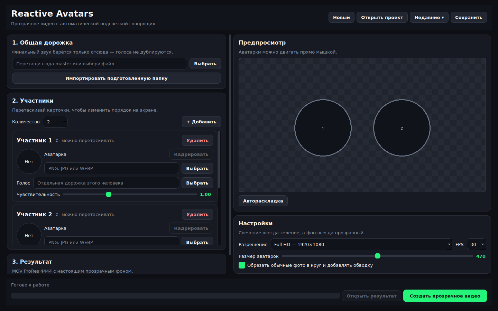

# Reactive Avatars

Десктопное приложение для создания прозрачного видео с аватарками участников разговора. Когда человек говорит, его аватарка подсвечивается зелёным, становится ярче и получает плавную анимацию.

Подходит для подкастов, Discord-записей, нарезок и роликов в CapCut, DaVinci Resolve, Premiere Pro и других редакторах.



## Возможности

- от 1 до 8 участников;
- общая аудиодорожка для финального звука;
- отдельная управляющая дорожка каждого участника;
- одновременная подсветка нескольких говорящих;
- индивидуальная чувствительность микрофона;
- автоматические раскладки и ручное перемещение аватарок;
- кадрирование обычных фотографий;
- единая круглая обводка и прозрачный фон;
- сохранение проектов в `.ravproj`;
- импорт подготовленной папки;
- экспорт в MOV ProRes 4444 с альфа-каналом;
- отмена рендера, прогресс и примерное оставшееся время.

## Быстрый запуск на Windows

1. Установите [Python 3.11 или новее](https://www.python.org/downloads/).
2. Скачайте репозиторий или архив последнего релиза.
3. Запустите `START.bat`.
4. При первом запуске дождитесь установки зависимостей.

Для сборки переносимой версии без Python запустите `BUILD_APP.bat`. Результат появится в `dist/ReactiveAvatars2`.

## Подготовка аудио

Приложению нужны:

- одна общая дорожка с готовым звуком всей записи;
- отдельная дорожка каждого участника, используемая только для определения речи.

Все дорожки должны начинаться в один момент. Не удаляйте тишину между репликами и в начале файлов. Длительность результата определяется общей дорожкой.

Для автоматического импорта папки используйте имена:

```text
master.wav
avatar1.png
voice1.wav
avatar2.png
voice2.wav
...
```

Поддерживаются аудиоформаты WAV, MP3, M4A, AAC, FLAC, OGG и OPUS, а также изображения PNG, JPG, JPEG, WEBP и BMP.

## Запуск из исходного кода

```bash
python -m venv .venv
```

Windows:

```powershell
.venv\Scripts\activate
python -m pip install -r requirements.txt
python main.py
```

Linux/macOS:

```bash
source .venv/bin/activate
python -m pip install -r requirements.txt
python main.py
```

Для разработки:

```bash
python -m pip install -e ".[dev]"
ruff check .
pytest
```

## Выпуск Windows-релиза

При отправке тега вида `v2.0.0` GitHub Actions автоматически:

1. собирает Windows-приложение через PyInstaller;
2. упаковывает папку приложения в ZIP;
3. создаёт GitHub Release и прикрепляет архив.

## Как помочь проекту

Сообщения об ошибках, идеи и pull request приветствуются. Перед началом прочитайте [CONTRIBUTING.md](CONTRIBUTING.md).

## Планы

- точная временная шкала активности;
- предпросмотр анимации до рендера;
- аппаратное ускорение экспорта;
- дополнительные языки интерфейса;
- установщик Windows и автоматическое обновление;
- шаблоны раскладок для вертикального видео.

## Лицензия

Проект распространяется по лицензии [MIT](LICENSE). Можно использовать, изменять и распространять код, сохраняя текст лицензии.
